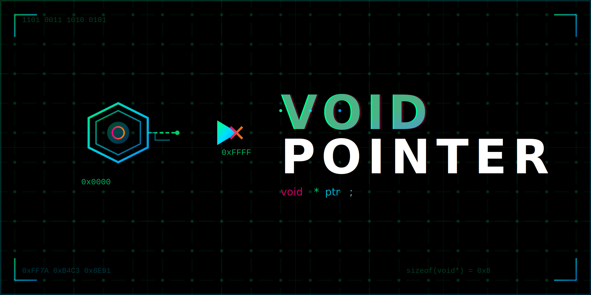

<div align="center">




[](https://github.com/voidptr-cxx)

</div>

---

<center>

</center>
### `$ whoami`

```cpp
class Developer {
private:
    std::string name = "voidptr-cxx";
    std::vector<std::string> languages = {"C", "C++", "Assembly"};
    std::string current_focus = "Low-level systems programming";
    
public:
    void* interests() {
        return reinterpret_cast<void*>(
            new std::vector<std::string>{
                "Memory management",
                "Performance optimization", 
                "System architecture",
                "Embedded systems",
                "Compiler internals"
            }
        );
    }
    
    [[nodiscard]] constexpr auto passion() const noexcept {
        return "Building things that go fast 🚀";
    }
};
```

<br clear="right"/>

---

## `⚡ Tech Stack`

<div align="center">


</div>

---

## `📊 GitHub Stats`

<div align="center">


</div>

<div align="center">

[](https://git.io/streak-stats)

</div>

<div align="center">

[](https://github.com/voidptr-cxx)

</div>

---

## `💻 Coding Activity`

<div align="center">

<a href="https://github.com/voidptr-cxx">
  
</a>


</div>

---

## `🔧 What I'm Working On`


<br>

```c
/* Currently focusing on */
typedef struct {
    const char* project;
    const char* description;
    int priority;
} CurrentWork;

CurrentWork stack[] = {
    {"High-performance data structures", 
     "Custom allocators & cache-friendly designs", 1},
    {"Systems programming", 
     "OS fundamentals & kernel modules", 2},
    {"Compiler exploration", 
     "Understanding the magic behind the code", 3}
};
```

<br clear="right"/>

---

## `🚀 Terminal Output`

```console
voidptr@github:~$ ./compile_dreams.sh
[████████████████████] 100% - Compiling imagination...
[✓] Optimization level: -O3
[✓] Warnings: -Wall -Wextra -Werror  
[✓] Standard: C++20
[✓] Memory leaks: 0 bytes
[SUCCESS] Build complete. Ready to ship! 🚀

voidptr@github:~$ git log --oneline --graph
* a4f8e2b (HEAD -> main) feat: implement lock-free queue
* 7b3d91c perf: optimize cache locality
* 2e9c5a1 refactor: RAII wrapper for raw pointers
* f1a7b8e docs: update memory management guide
```

---

## `📈 Contribution Metrics`

<div align="center">


</div>

---

## `💡 Philosophy`


<div align="center">

> *"C makes it easy to shoot yourself in the foot; C++ makes it harder, but when you do, it blows away your whole leg."*
> 
> — Bjarne Stroustrup

</div>

**Core Principles:**
- 🎯 **Manual memory management** - Understanding what happens under the hood
- ⚡ **Zero-cost abstractions** - Performance without compromise  
- 🔒 **RAII** - Because destructors are your friends
- 📝 **Const correctness** - If it doesn't mutate, mark it const
- 📊 **Profile before optimizing** - But always write efficient code

---

## `🎯 Current Learning Path`

<div align="center">


</div>

```cpp
auto learning_queue = std::queue<std::string>{
    "Advanced template metaprogramming",
    "Lock-free data structures", 
    "SIMD optimization techniques",
    "Modern C++ (C++20/23)",
    "Reverse engineering basics"
};

while(!learning_queue.empty()) {
    auto topic = learning_queue.front();
    master(topic);
    learning_queue.pop();
}
```

---

## `🏆 Achievements`

<div align="center">

[](https://github.com/voidptr-cxx)

</div>

---

## `🐍 Contribution Snake`

<div align="center">

<picture>
  <source media="(prefers-color-scheme: dark)" srcset="https://raw.githubusercontent.com/voidptr-cxx/voidptr-cxx/output/github-contribution-grid-snake-dark.svg">
  <source media="(prefers-color-scheme: light)" srcset="https://raw.githubusercontent.com/voidptr-cxx/voidptr-cxx/output/github-contribution-grid-snake.svg">
  
</picture>

</div>

---

## `📫 Connect With Me`

<div align="center">


```
0x00000000: Exploring memory addresses
0x00000008: Dereferencing pointers  
0x00000010: Segmentation fault (core dumped)
0x00000018: git push origin main
0x00000020: while(true) { code(); }
```

<br>

**Let's collaborate on low-level projects or discuss systems programming!**

<br>

<a href="https://github.com/voidptr-cxx">
  
</a>

</div>

---

<div align="center">


### `while(alive) { code(); learn(); optimize(); }`

```
╔═══════════════════════════════════════════════╗
║                                               ║
║    "In C we trust, in C++ we abstract"        ║
║                                               ║
║         ./voidptr --version 1.0.0             ║
║                                               ║
╚═══════════════════════════════════════════════╝
```


*Built with ⚡ by voidptr-cxx*

</div>
